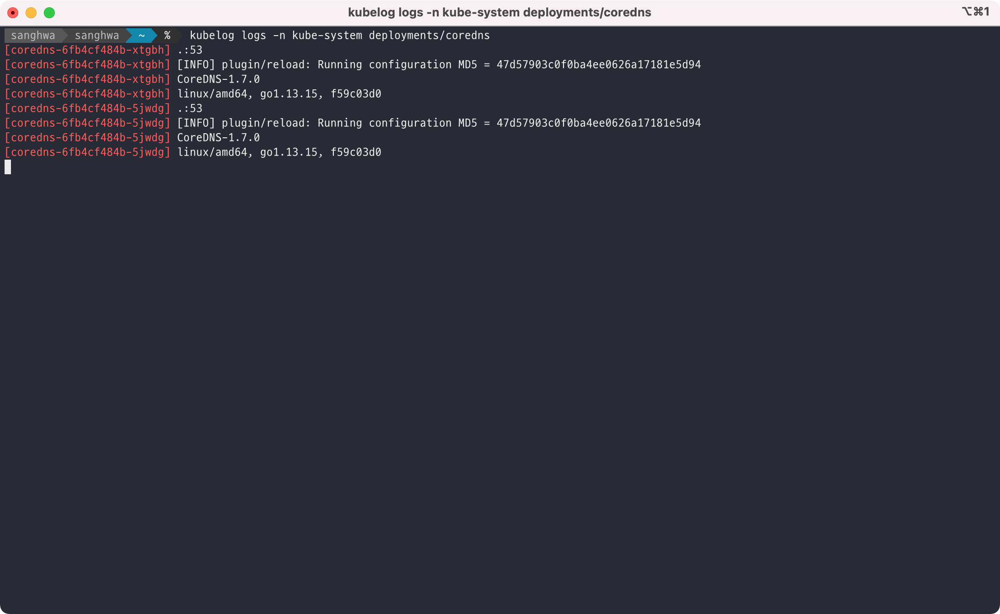

# kubelog
kubelog allows user to aggregate logs using cli command.

## How to use
You can aggregate logs like this:



## Examples
Stream logs from pod nginx with only one container:
```bash
kubelog logs nginx -n default
```

Stream all pod logs in a deployment, daemonset or statefulset:
```bash
kubelog logs deployment/nginx -n default
```

See `kubelog --help` for details.

## Installation
Install (and update) the package with:

```bash
$ go get github.com/didhd/kubelog/...
```

By default it will be in `$GOPATH/bin`, if you want to change that, you can set your `$GOPATH` or `$GOBIN`.

Or you can build and install manually after cloning the repository.
```bash
$ go build
$ sudo cp kubelog /usr/local/bin/
```

## Configuration
Configuration follows current kubeconfig.
